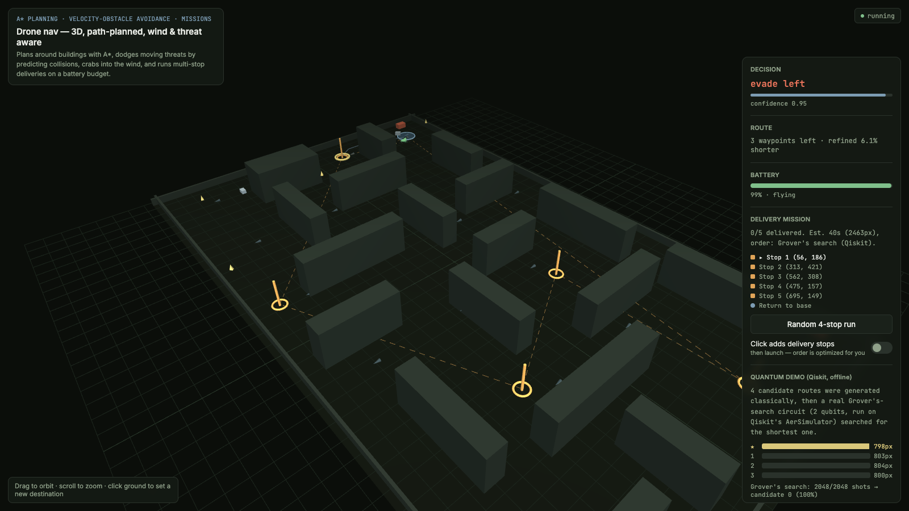

# Drone Delivery Navigation Sim

A 3D drone navigation and delivery simulator that runs entirely in the
browser, plus Qiskit experiments that apply Grover's search to delivery
routing.

**▶ [Try the live demo](https://pavanpratapagiri.github.io/rover-nav-sim/)** ·
[jump straight into the Grover-chosen delivery run](https://pavanpratapagiri.github.io/rover-nav-sim/sim-3d/rover-sim-3d.html#grover)



## Features

- **Path planning:** A* over an occupancy grid, line-of-sight smoothing,
  and a simulated-annealing refinement pass.
- **Threat avoidance:** predicts where birds, vans and rogue rovers will be
  (velocity obstacles) and picks the safest heading that still makes
  progress, or hovers.
- **Wind compensation:** crabs into the wind so the ground track follows
  the planned path.
- **Multi-stop deliveries:** finds the visiting order with the shortest
  estimated mission time, recharge detours included (exact for up to 7
  stops).
- **Battery model:** plans recharges at the base pad, and a live failsafe
  returns home early if the drone is burning more than planned.
- **Quantum routing demo:** Grover's search (Qiskit, 7 qubits, simulator)
  picks the best order for a 5-stop mission out of 120 possibilities. It
  finds the exact optimum, verified against the classical answer. At this
  size it is a demonstration of the algorithm, not a speed-up (see below).
- **Tested:** a seeded headless stress test flies 1,500 missions per run,
  and every one completes.

## Running it

- **Sim:** open `sim-3d/rover-sim-3d.html` in any modern browser. No build
  step. Drag to orbit, scroll to zoom, click the ground to fly somewhere.
  Use "Random 4-stop run" or "Click adds delivery stops" for missions,
  and the 1×/2×/4× button to change speed.
- **Stress test:** `node tests/stress.js` (see [Testing](#testing)).
- **Qiskit demos:** see `qiskit/` below.

The rest of this README is technical notes on how it works and why.

## What's here

- **`sim-2d/rover-sim.html`** — the original 2D top-down version. Canvas
  rendering, reactive-only navigation (no path planning). Kept as a
  simpler reference; the 3D version superseded it functionally.
- **`sim-3d/rover-sim-3d.html`** — the real deliverable. Three.js 3D scene,
  A* path planning + classical "quantum-inspired" (simulated annealing)
  route refinement, reactive collision/threat avoidance as a safety layer
  on top of the planned route, wind drift, 18 static obstacles (verified
  fully connected — see Known Issues), 11 moving threats (birds, rogue
  rovers, delivery vans). Self-contained single HTML file, no build step —
  just open it.
- **`qiskit/`** — a genuine Qiskit demo (Python, `AerSimulator` — local
  simulator, not real IBM hardware). Runs Grover's search to pick the shortest of 4
  candidate routes for the *current* `sim-3d` obstacle map. The winning
  route is embedded verbatim (not re-derived) in `sim-3d`'s
  `QUANTUM_RESULT` constant, flyable via the "Fly the Qiskit-selected
  route" button in that page's UI.
  **If you change the obstacle map in `sim-3d`, this script's `OBSTACLES`
  list goes stale and the embedded path can cut through a new building —
  re-run it and re-embed the new `result.json`'s `winning_path`.** A
  `segmentClear`-based check in the script is worth reusing to verify
  before re-embedding.
- **`qiskit/grover_delivery_order.py`** — Grover's search (Dürr–Høyer
  minimum finding, 7 qubits, AerSimulator) picks the visiting order for a
  fixed 5-stop delivery mission out of all 120 orders, scored with the same
  time model as the sim's planner. Finds the exact optimum (39.9s vs 76.7s
  worst); a single 6-iteration search puts 99.7% of shots on the best order
  vs 1.7% by chance. Embedded in `sim-3d` as `GROVER_DELIVERY` ("Fly the
  Grover-chosen delivery run"). **Honest limit:** the oracle is built from
  all 120 classically computed costs, so this is a demonstration of the
  algorithm, not a speed-up — the classical planner solves it in ~1 ms.
  `tests/stress.js` fails if the embedded order stops being optimal (e.g.
  after a map change), so it can't go stale silently. Shared map/A* code
  lives in `qiskit/nav_map.py`. Setup:
  `python3 -m venv qiskit/.venv && qiskit/.venv/bin/pip install -r qiskit/requirements.txt`,
  then `qiskit/.venv/bin/python qiskit/grover_delivery_order.py` (~30s).
- **`ios/`** — a SwiftUI/Canvas port of the *2D* (not 3D) sim, written as
  source files for a fresh Xcode project. Not wired to the newer 3D
  features (A*, quantum demo, denser map) — it reflects an earlier state
  of the project.

## Architecture notes for `sim-3d` (the main file)

Single `<script>` block, roughly in this order:
1. **Navigation core** (pure logic, no Three.js): obstacle map, A*
   (`astar`), path smoothing (`smoothPath`), the annealing refinement
   (`annealPath`), velocity-obstacle evasion (`chooseEvasion`), the decision
   function (`decide`), and `simStep(dt)` — one physics step (wind, threats,
   collisions, a decision every 0.15s). `decide` prioritizes: arrival →
   waypoint advance / skip-ahead → line-of-sight replan → threat evasion →
   reactive body-proximity avoidance → wind-corrected waypoint steering.
2. **Battery + missions** (still pure logic): every flight is a mission (a
   list of legs). `goTo()` is a one-leg trip; `planMission(stops)` builds a
   delivery run — see below.
3. `// @@END_NAV_CORE@@` marker — `tests/stress.js` extracts everything
   above it and runs it in Node. Keep rendering code below it.
4. **Three.js rendering**: scene, meshes, stop pillars, base pad, manual
   orbit camera (hand-rolled, no OrbitControls — avoids extra CDN loads).
5. **UI wiring + main loop**: buttons, toggles, HUD. The loop runs
   `simStep` in fixed 1/60s substeps (× the 1×/2×/4× speed setting) so a
   slow device still runs in real time.

### Navigation
- **Velocity-obstacle threat avoidance**: when the current velocity is
  predicted to hit any threat within `VO_HORIZON` (1.6s), score 24 candidate
  headings + hovering by time-to-collision against *every* threat, static
  clearance ahead, and progress toward the waypoint; fly the best.
  `timeToCollision` treats "already inside the margin but separating" as
  safe — without that every candidate ties at ttc=0 and the drone flies
  straight through vans.
- **Line-of-sight recovery**: if the next waypoint is behind a building
  (after evasion or drift), replan from here instead of steering into it.
- **Waypoint skip-ahead**: target the furthest of the next 4 waypoints in
  clear view. Fixes a U-turn loop in narrow corridors where each replan
  started behind the drone.
- **Wind correction**: heading is chosen so air velocity + wind drift points
  at the target (a crab angle).

### Missions + battery
- `planMission` computes pairwise A* distances, then picks the visiting
  order that minimizes **estimated mission time including recharge
  detours** (`walkTour`: walks the tour with a simulated battery and
  inserts a base recharge before any stop it couldn't reach *and* still
  get home from with `RESERVE` (10%) left). Exact brute force ≤7 stops;
  nearest-neighbour + 2-opt above. An optional forced order lets the
  Grover demo fly its own pick.
- Battery: a full charge is ~90s of cruise (was ~45s; see Testing).
- Live failsafe (`checkReturnToBase`, 1 Hz): if charge < energy for the
  real A* route home × `RTB_MARGIN` + reserve, divert to base, recharge,
  resume. Drain: 1.1%/s cruise, 1.4%/s evading, 0.75%/s hover, 0 landed.
- Arrival is tracked per leg: two stops closer than the arrival radius
  used to hang the drone forever (the second arrival never registered).

Key tuned constants (don't change without re-running the stress test —
several of these fixed real bugs, not arbitrary tuning):
- `PAD` (16) is the A* planner's obstacle clearance.
- `DANGER` (14) is the reactive-avoidance trigger distance. **Must stay
  below `PAD`** — I once set it higher and the reactive layer fought the
  planned path constantly (thought a valid route was "too close").
- `AVOID_COMMIT_TICKS` (5): reactive avoidance commits to one turn
  direction for ~0.75s instead of re-deciding every tick. Without this it
  oscillates; with an *unbounded* commit instead it can permanently
  corner-lock (found and reverted that during testing).
- `EVADE_BREAK_TICKS` (20): after ~3s of continuous threat evasion, force
  a push-through. Without this, a threat patrolling a chokepoint can block
  forward progress indefinitely.
- `STUCK_TIMEOUT` (6s): watchdog that forces an A* replan if no real
  progress toward the destination has been made.
- `RTB_MARGIN` (1.25) + full `RESERVE`: the failsafe's own headroom. A
  straight-line × 1.35 estimate with half the reserve let drones die 1%
  short of the pad after a threat-heavy chokepoint on the way home.

## Testing

```
node tests/stress.js [trials=200] [maxSimSeconds=200] [default|random|multistop|all]
```

Seeded (reproducible) trials of the real nav core in a Node `vm`. Exits
non-zero on any non-finite state, battery depletion, or a stale embedded
Grover order. `SIM_HTML=path` tests another copy of the page (handy for
before/after comparisons). Current results (300 trials each, 400s cap):

| scenario | success | mean time | threat hits / flight | wall bumps / flight |
|---|---|---|---|---|
| default route | 100% | 15.0s | 0.9 | 1.5 |
| random destination | 100% | 8.2s | 0.5 | 0.7 |
| 4-stop delivery | 100% | 36.5s | 2.5 | 4.8 |
| 7-stop delivery | 100% | 46.0s | 3.3 | 6.5 |
| Grover's 5-stop mission | 100% | 45.6s | 4.1 | 5.0 |

History, same harness:
- Navigation round (default route, same threat physics): 2.38 hits and
  15.7 wall bumps per flight → ~0.9 / ~1.5. The "~93% arrival" figure from
  the earlier session didn't reproduce — the old nav already arrived 100%;
  its real weakness was collisions.
- Delivery speed round: 4-stop runs 45.4s → 36.5s (−20%), 7-stop runs
  65.2s → 46.0s (−30%, and 2/200 battery depletions → 0). **Nearly all of
  that is the bigger battery** — mid-mission trips home were most of the
  extra time. The time-aware ordering alone is worth −5% on 7-stop runs
  when recharges are frequent (65.2s → 62.0s on the old small battery);
  with the new battery recharges are rare, so it rarely changes the order.
- Fixed a threat-physics bug: after striking the drone, a threat bounced
  using its old per-axis speeds, so one moving perpendicular to the
  contact stayed stuck to the drone and re-struck up to 8 times in a row.

## Known issues / honest limitations

- **Browser check was limited.** It renders, runs a full 4-stop mission
  to completion, and lays out on mobile (checked in a real browser pane),
  but that pane only delivered ~1–2 fps (software GL), so real-device
  frame rate and touch orbiting are still unconfirmed.
- Most remaining wall bumps come from evasion near walls; delivery runs
  still average ~3 threat strikes (they fly ~3× longer).
- Sensing is perfect (no noise, no field-of-view limits, no occlusion) —
  unrealistic compared to real hardware.
- Altitude is cosmetic; the drone can't fly over short obstacles, only
  around everything.
- Single agent only — no multi-drone coordination.
- Threats drive/fly through buildings (they only bounce off the arena edge).

## Roadmap (v2)

1. **QAOA for delivery ordering** — the natural quantum formulation of
   the stop-ordering problem (the Grover demo searches a precomputed cost
   table; QAOA encodes the tour cost itself in the circuit).
2. **Real IBM quantum hardware** — run the same circuits on IBM Quantum
   and compare noisy hardware results with the simulator and the exact
   classical optimum.
3. **Fleet routing as a QUBO** — several drones share the stops (a
   vehicle-routing problem), formulated for QAOA and quantum annealers.
4. **Delivery deadlines and live orders** — orders arrive mid-mission
   with time windows; the planner re-optimizes on the fly.
5. **A live quantum routing backend** — a small Python service that runs
   the quantum search on demand when a mission is planned, instead of the
   precomputed result embedded in the page.
6. **CI** — run `tests/stress.js` on every push.

Later: sensor noise / limited field of view, and porting the new nav +
missions to the iOS app (still the old 2D version).
